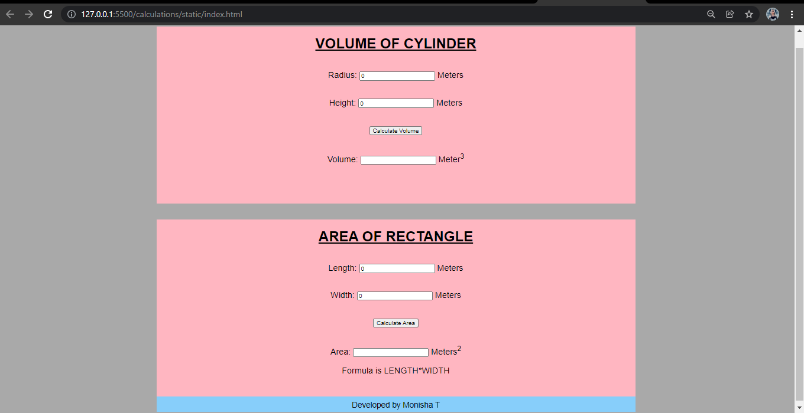
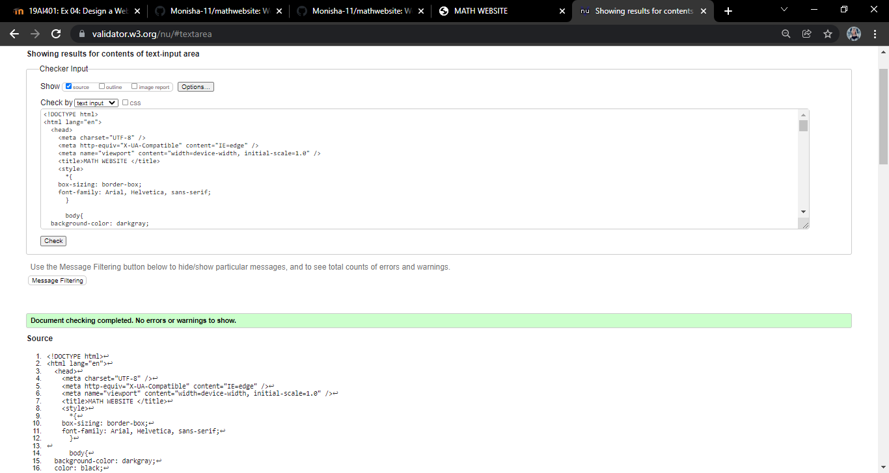

# Web Page for Mathematical Calculations

## AIM:

To design a static website with validation to perform mathematical calculations in client side.

## DESIGN STEPS:

### Step 1:

Requirement collection.

### Step 2:

Creating the layout using HTML and CSS.

### Step 3:

Write javascript to perform the calculations.

### Step 4:

Include regularexpression based input validation.

### Step 5:

Validate the layout in various browsers.

### Step 6:

Validate the HTML code.

### Step 6:

Publish the website in the given URL.

## PROGRAM :
```
<!DOCTYPE html>
<html lang="en">
  <head>
    <meta charset="UTF-8" />
    <meta http-equiv="X-UA-Compatible" content="IE=edge" />
    <meta name="viewport" content="width=device-width, initial-scale=1.0" />
    <title>MATH WEBSITE </title>
    <style>
      *{
    box-sizing: border-box;
    font-family: Arial, Helvetica, sans-serif;
      }

      body{
  background-color: darkgray;
  color: black;
}

.container{
  width: 1080px;
  margin-left: auto;
  margin-right: auto;
}

.content{
  display: block;
  width: 100%;
  margin-left: auto;
  margin-right: auto;
  background-color: lightpink;
  margin-top: 35px;
  min-height: 400px;
}

h1{
    color: black;
    text-align: center;
    padding-top: 20px;
}

.formelement{
    text-align: center;
    padding-top: 20px;
    font-size: larger;
}

.footer{
    display: inline-block;
    width: 100%;
    height: 35px;
    background-color: lightskyblue;
    color: black;
    text-align: center;
    padding-top: 10px;
    font-size: large;
}

    </style>
</head> 
<body>
  <div class="container">
    <div class="content">
        <h1><u>VOLUME OF CYLINDER</u></h1>
        <form>
            <div class=formelement>
                <label for="aedit">Radius:</label>
                <input type="text" id="aedit" value="0"/> Meters
            </div><br>
            <div class=formelement>
                <label for="bedit">Height:</label>
                <input type="text" id="bedit" value="0"/> Meters
            </div><br>
            <div class=formelement>
                <input type="button" value="Calculate Volume" id="addbutton"/>
            </div><br>
            <div class=formelement>
                <label for="cedit">Volume:</label>
                <input type="text" id="cedit" readonly value="0"/> Meter<sup>3</sup>
            </div>
        </form>
    </div>
</div>
<script>
var button;
 
button=document.querySelector("#addbutton");
button.addEventListener("click",function(){
    
    var atext,btext,ctext;
    var aval,bval,cval;
    var result,result1,rexp;
    atext=document.querySelector("#aedit");
    btext=document.querySelector("#bedit");
    ctext=document.querySelector("#cedit");

    Rexp=new RegExp("^[1-9]+[0-9]*$");

    aval=atext.value;
    result=aval.match(rexp);
    bval=btext.value;
    result1=bval.match(rexp);

    if(result==null)
    {
        alert("please enter only positive integers for radius")
    }
    if(result1==null)
    {
        alert("please enter only positive integers for height ")
    }
    
    cval=22/7*aval*aval*bval;
    ctext.value=""+cval;

});
</script>
<div class="container">
  <div class="content">
      <h1><u>AREA OF RECTANGLE</u></h1>
      <form>
          <div class=formelement>
              <label for="ledit">Length:</label>
              <input type="text" id="ledit" value="0"/> Meters
          </div><br>
          <div class=formelement>
              <label for="wedit">Width:</label>
              <input type="text" id="wedit" value="0"/> Meters
          </div><br>
          <div class=formelement>
              <input type="button" value="Calculate Area" id="calbutton"/>
          </div><br>
          <div class=formelement>
              <label for="xedit">Area:</label>
              <input type="text" id="xedit" readonly value="0"/> Meters<sup>2</sup>
          </div>
          <div class=formelement>
              Formula is LENGTH*WIDTH
          </div>
      </form>
  </div>
  <div class="footer">Developed by Monisha T </div>
  </div>

  <script>
      var button;
      button=document.querySelector("#calbutton");
      button.addEventListener("click",function(){
          var ltext,wtext,xtext;
          var lval,wval,xval;
          var result2,result3,rexp1;
          ltext=document.querySelector("#ledit");
          wtext=document.querySelector("#wedit");
          xtext=document.querySelector("#xedit");

          rexp1=new RegExp("^[1-9]+[0-9]*$");

          lval=ltext.value;
          result2=lval.match(rexp1);
          wval=wtext.value;
          result3=wval.match(rexp1)

          if(result2==null)
          {    
              alert("please enter only positive integer for length")
          }

          if(result3==null)
          {    
              alert("please enter only positive integer for width")
          }

            xval=lval*wval;
            xtext.value=""+xval;
 
         });
  </script>
</body>
</html>

```

## OUTPUT:




## Result:

Thus a website is designed to perform mathematical calculations in the client side.
